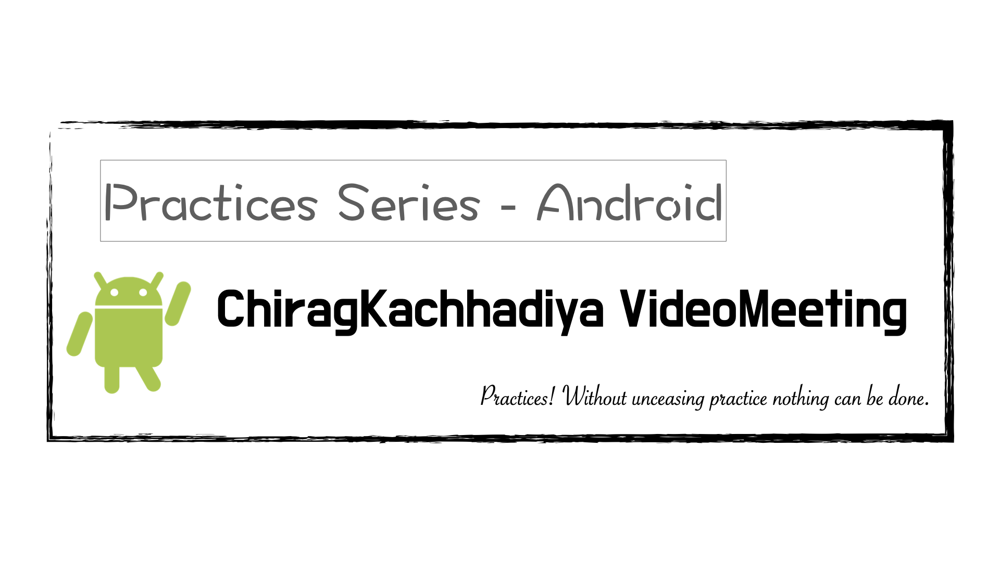
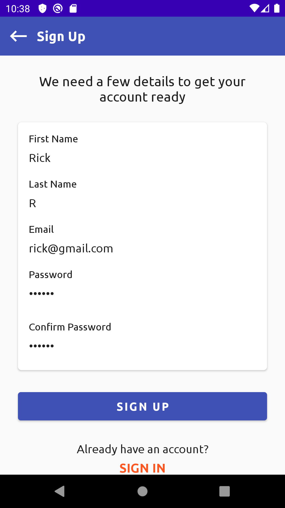
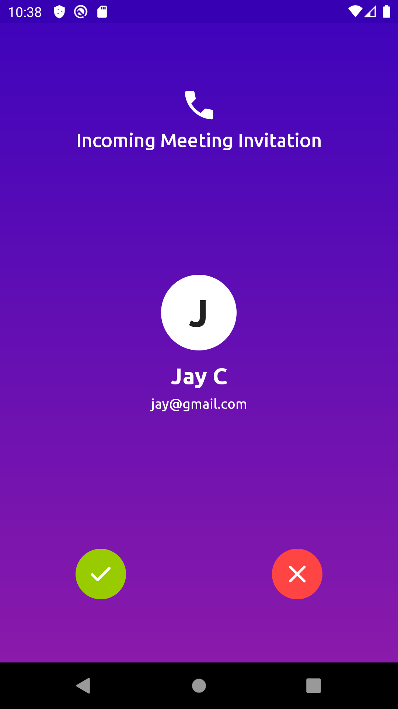

# ChiragKachhadiya VideoMeeting
Practices Series：Android

---

---

### 說明 ###

本專案為「[Chirag Kachhadiya](https://www.youtube.com/channel/UCmL5TAblHHgh1xhabmPjYgw)」分享於「Youtube」平台。

###### 參考連結： ######

- [Android Video Meeting App Development | Episode #1 | Project Setup | Primary Layout Design](https://www.youtube.com/watch?v=WvJBXWiSkTU&list=PLam6bY5NszYNR54PiY_NN7hGS858xinq-&index=1)
- [Android Video Meeting App Development | Episode #2 | Setup Firebase Cloud Messaging & Firestore](https://www.youtube.com/watch?v=P54aEc4QYzI&list=PLam6bY5NszYNR54PiY_NN7hGS858xinq-&index=2)
- [Android Video Meeting App Development | Episode #3 | Sign Up Using Firestore](https://www.youtube.com/watch?v=JO9McV-_2uE&list=PLam6bY5NszYNR54PiY_NN7hGS858xinq-&index=3)
- [Android Video Meeting App Development | Episode #4 | Sign In Using Firestore & Shared Preferences](https://www.youtube.com/watch?v=aVwLY4ngoVY&list=PLam6bY5NszYNR54PiY_NN7hGS858xinq-&index=4)
- [Android Video Meeting App Development | Episode #5 | Working With FCM Token & Sign Out](https://www.youtube.com/watch?v=JDsgAReslD4&list=PLam6bY5NszYNR54PiY_NN7hGS858xinq-&index=5)
- [Android Video Meeting App Development | Episode #6 | Display User List From Firestore Database](https://www.youtube.com/watch?v=4DHTsIJNts8&list=PLam6bY5NszYNR54PiY_NN7hGS858xinq-&index=6)
- [Android Video Meeting App Development | Episode #7 | Setup Retrofit | Additional Configurations](https://www.youtube.com/watch?v=Q09KcjVfH6Q&list=PLam6bY5NszYNR54PiY_NN7hGS858xinq-&index=7)
- [Android Video Meeting App Development | Episode #8 | Incoming & Outgoing Invitation Screens Design](https://www.youtube.com/watch?v=xc7KRwJGPH8&list=PLam6bY5NszYNR54PiY_NN7hGS858xinq-&index=8)
- [Android Video Meeting App Development | Episode #9 | Initiate Video Meeting(Send Meeting Invitation)](https://www.youtube.com/watch?v=cQkuWMB_9SY&list=PLam6bY5NszYNR54PiY_NN7hGS858xinq-&index=9)
- [Android Video Meeting App Development | Episode #10 | Accept, Reject & Cancel Meeting Invitation](https://www.youtube.com/watch?v=W5UrLfa3zk4&list=PLam6bY5NszYNR54PiY_NN7hGS858xinq-&index=10)
- [Android Video Meeting App Development | Episode #11 | The Video Meeting Using Jitsi Meet](https://www.youtube.com/watch?v=iVK9BrbLPz0&list=PLam6bY5NszYNR54PiY_NN7hGS858xinq-&index=11)
- [Android Video Meeting App Development | Episode #12 | The Audio Meeting Using Jitsi Meet](https://www.youtube.com/watch?v=ax1-qbhI-Tg&list=PLam6bY5NszYNR54PiY_NN7hGS858xinq-&index=12)
- [Android Video Meeting App Development | Episode #13 | Video Meeting (Conference) With Multiple Users](https://www.youtube.com/watch?v=YF7cEz33HWc&list=PLam6bY5NszYNR54PiY_NN7hGS858xinq-&index=13)
- [Android Video Meeting App Development | Episode #14 | Disable Battery Optimizations](https://www.youtube.com/watch?v=Y7hCZqLYgGE&list=PLam6bY5NszYNR54PiY_NN7hGS858xinq-&index=14)

---

#### 預覽圖 ####

|         動態預覽圖         |         登入         |       單人通話       |      多人通話       |
|:--------------------------:|:--------------------:|:--------------------:|:-------------------:|
|  |  |  |  |

---

###### tags: `Android` `Java`
